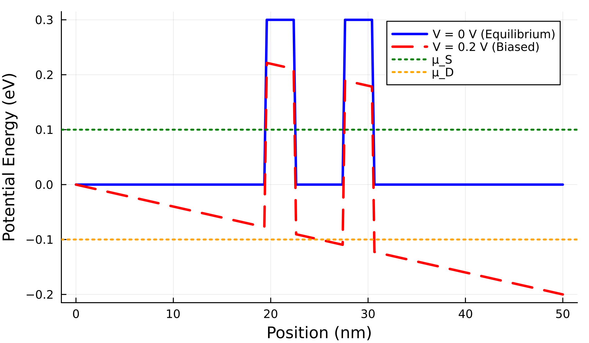
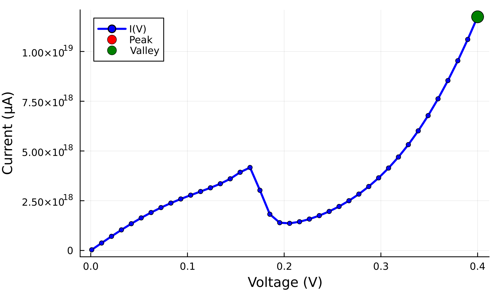
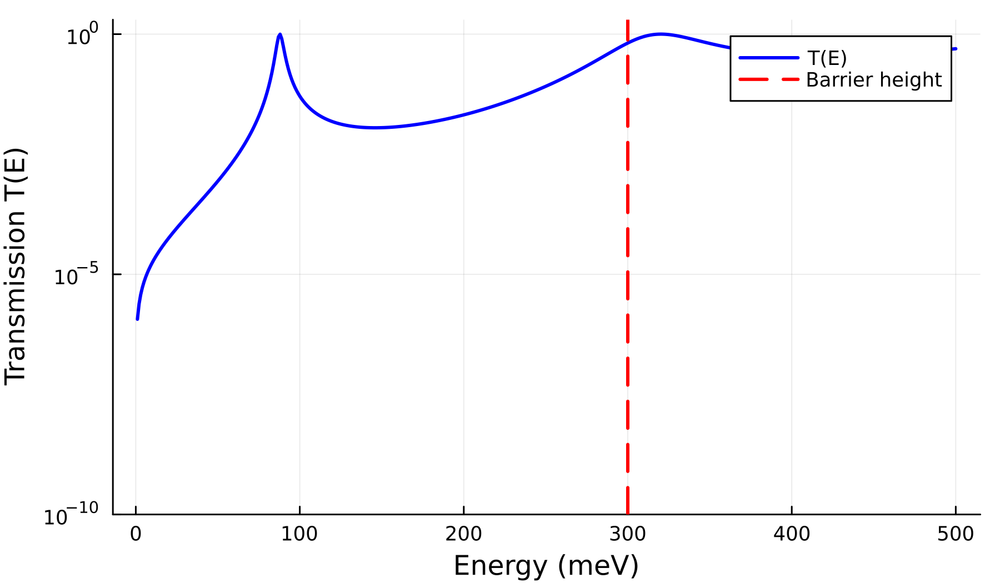
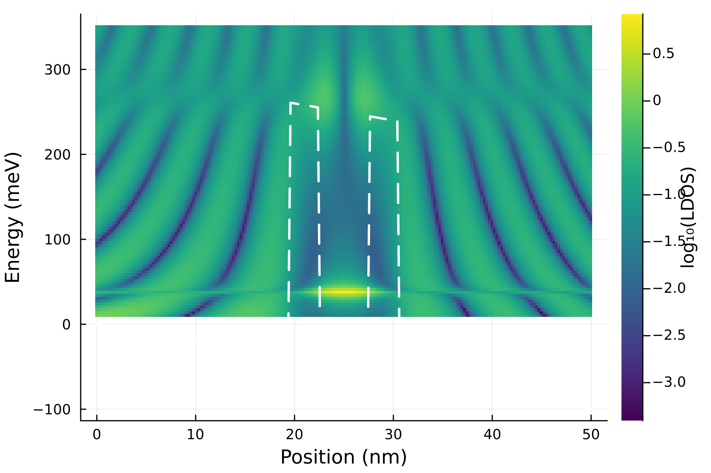

# Resonant Tunneling Diode Simulator

<div align="center">

**Quantum Transport Simulation using Non-Equilibrium Green's Functions**

*A Julia implementation of coherent electron transport through nanoscale semiconductor heterostructures*

[](https://julialang.org/)
[](LICENSE)

[Interactive Notebook](rtd_simulation.ipynb) • [Full Paper](../RTD_simulator/index.qmd) • [Preprint](https://www.researchgate.net/publication/398537007)

</div>

---

## Introduction

This project simulates **Resonant Tunneling Diodes (RTDs)** quantum device by exploiting exploit the wave nature of electrons. RTDs can actually decrease their current when you increase the voltage, and resonate once a certain voltage bias is imposed, this duality makes them useful for numerous applications.

Unlike classical electronic components where electrons move like particles over barriers, in RTDs electrons behave as waves that can "tunnel" through barriers. When the electron energy perfectly aligns with a resonant state trapped between two barriers, the transmission probability increases, meaning the electrons pass through. This phenomena is what is studied in this project.

<div align="center">

### The Quantum Double-Barrier Structure



*Two thin barriers (red peaks) sandwich a quantum well. Electrons tunnel through via resonant states.*

</div>

---

### Negative Differential Resistance

The hallmark of RTDs: current first increases with voltage, reaches a peak, then *decreases* despite higher voltage.

<div align="center">

</div>

At low voltage, the resonant energy level in the quantum well aligns with incoming electrons (high current). At higher voltage, this level shifts. Such that the electrons can no longer tunnel efficiently (current drops).

### Quantum Resonances

Transmission isn't uniform it shows dramatic peaks at specific energies.

<div align="center">

</div>

**Physical Interpretation:** The peaks occur at energies $E_n = n^2\pi^2\hbar^2 / 2m^*w^2$ where the electron wavelength perfectly fits inside the well width $w$.

### Local Density of States

Where do electrons actually "live" inside the device? The quantum density map reveals they concentrate in the well at resonant energies—a purely quantum effect.

<div align="center">

</div>

---

## Mathematics/physics Behind It

This simulator implements the **Non-Equilibrium Green's Function (NEGF)** formalism—the rigorous quantum mechanical framework for calculating electron transport in open systems. Key concepts:

- **Green's Functions:** Mathematical tools that propagate quantum states through space and time
- **Self-Energy:** How semi-infinite contacts (source/drain) affect the finite device region
- **Landauer-Büttiker Formula:** Connects microscopic quantum transmission to macroscopic electrical current

### Theoretical Foundation

This work builds on a previous study of numerical methods for quantum mechanics :

> **Idirene, D.** (2025). *Numerically Solving the Time-Dependent Schrödinger Equation: Analysis of Unitarity, Stability, and Real-Time GPU Implementation*. ResearchGate Preprint.  
> [https://doi.org/10.13140/RG.2.2.32583.02722](https://www.researchgate.net/publication/398537007)

That preprint explored time-dependent simulations (wavepacket dynamics, double-slit interference, etc.). This project extends that foundation to **steady-state quantum transport** where electrons continuously flow through a device connected to electrodes—requiring the NEGF formalism to handle open boundary conditions.

---

### Prerequisites

```julia
using Pkg
Pkg.add(["LinearAlgebra", "SparseArrays", "Plots"])
```

### Run the Simulation

**Option 1: Interactive Notebook** (Recommended)
```bash
jupyter notebook rtd_simulation.ipynb
```
Run all cells to see the physics unfold step-by-step with visualizations.

**Option 2: Generate Figures**
Open the notebook and execute the final cell to export all publication-quality figures.

---

| Resource | Purpose | Audience |
|----------|---------|----------|
| **[Interactive Notebook](rtd_simulation.ipynb)** | Complete implementation with code, equations, and plots | Computational physicists, Julia developers |
| **This README** | High-level overview and visual results | General audience, quick reference |

### For the Mathematics

The full paper derives most of the expressions or at least gives an intuition from first principles,
- Discretization of the Schrödinger equation using finite differences
- Derivation of self-energies for semi-infinite tight-binding chains
- Proof that the limiting absorption principle enforces Sommerfeld radiation conditions
- Spectral representation of Green's functions

### For the Code

The Jupyter notebook contains:
- Fully-commented Julia implementation (~800 lines)
- Device parameters struct for easy experimentation
- Visualization of transmission, I-V curves, and LDOS
- Export functions for publication-quality figures


## Why read?

This project serves as:

1. **Teaching Tool:** Self-contained introduction to NEGF for graduate quantum mechanics courses
2. **Research Starting Point:** Gives an application to quantum mechanics system from another perspective.
---

## References & Further Reading

**Foundational Texts:**
- Datta, S. (2005). *Quantum Transport: Atom to Transistor*. Cambridge University Press.

**NEGF Tutorial:**

- A. Thakur and N. Sarkar, *A tutorial on the NEGF method for electron transport in devices and defective materials,* The European Physical Journal B, vol. 96, no. 8, Aug. 2023, doi: https://doi.org/10.1140/epjb/s10051-023-00580-5.
‌
**Original RTD Experiments:**
- Tsu, R., & Esaki, L. (1973). Tunneling in a finite superlattice. *Appl. Phys. Lett.*, 22(11), 562-564.

---

## Contributing

Suggestions and improvements welcome! Feel free to:
- Open issues for bugs or clarifications
- Submit PRs for additional features (e.g., magnetic fields, disorder, new materials)
- Use this code in your own research (cite the repository)

---

## License

MIT License - feel free to use for research and education.

---

## Author

**Daris Idirene**  
Undergraduate Student Université Paris-Saclay
[ResearchGate Profile](https://www.researchgate.net/profile/Daris-Idirene)